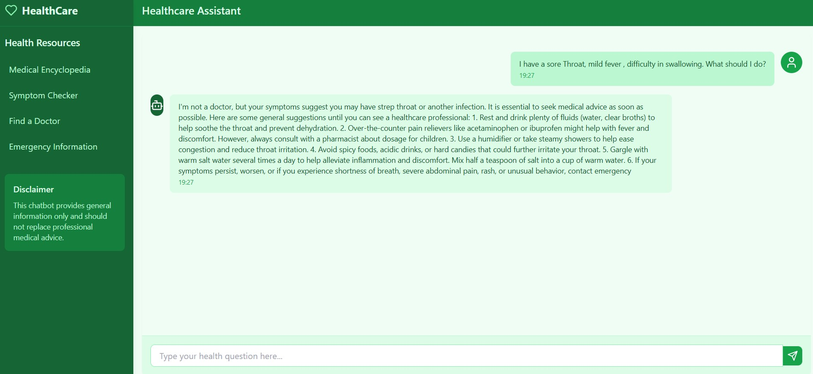
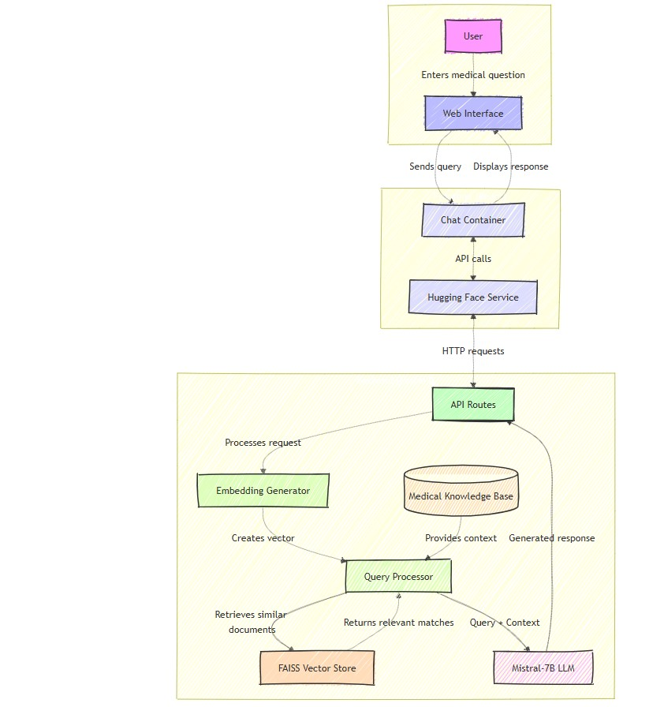

# 🩺 MedicalRAG Chatbot



A modern healthcare AI assistant with real-time RAG (Retrieval-Augmented Generation) capabilities, powered by Mistral-7B.

For Live Demo:
[https://medicalchatbot](https://medicalragchatbot.netlify.app/)


## ✨ Features

- **Advanced AI Integration** - Leverages Hugging Face's Mistral-7B model for precise medical responses
- **Real-Time RAG System** - Generates embeddings on-the-fly for accurate information retrieval
- **Vector Search** - Uses FAISS for lightning-fast similarity searches
- **Responsive Design** - Clean, intuitive interface that works on all devices
- **Modular Architecture** - Separate backend and frontend for maintainable development

## 🔍 How It Works

MedicalRAG uses a sophisticated architecture that combines AI with efficient vector search:




1. **User Input** - The user submits a healthcare question through the React frontend
2. **Embedding Generation** - The query is transformed into vector embeddings
3. **Knowledge Retrieval** - FAISS searches for the most relevant medical information
4. **Context-Aware Response** - Mistral-7B generates accurate, helpful answers based on retrieved context

## 🛠️ Tech Stack

- **Frontend**: React with TypeScript, Tailwind CSS
- **Backend**: FastAPI (Python)
- **AI**: Hugging Face's Mistral-7B model
- **Vector Store**: FAISS (Facebook AI Similarity Search)
- **Development**: Vite, ESLint, Prettier

## 📁 Project Structure

```
healthcare-chatbot/
├── backend/                  # FastAPI backend
│   ├── api.py                # Main API routes
│   ├── .env                  # Environment variables (store HF_TOKEN here)
│   ├── Pipfile               # Python dependencies
│   └── vectorstore/          # Vector database storage
│       └── db_faiss/         # FAISS vector database
├── frontend/                 # React frontend
│   ├── src/
│   │   ├── App.tsx           # Main application component
│   │   ├── ChatContainer.tsx # Chat message display component
│   │   ├── ChatInput.tsx     # Message input component
│   │   ├── ChatMessage.tsx   # Individual message component
│   │   ├── types.ts          # Type definitions
│   │   └── huggingfaceService.ts # Hugging Face API service
│   ├── .env                  # Environment variables (VITE_HF_API_KEY)
│   └── vite.config.ts        # Vite configuration
└── README.md                 # Project documentation
```

## 🚀 Getting Started

### Prerequisites

- Node.js (v16+)
- Python (v3.8+)
- Hugging Face API token

### Backend Setup

1. **Clone repository**:
   ```bash
   git clone https://github.com/yourusername/medical-rag-chatbot.git
   cd medical-rag-chatbot/backend
   ```

2. **Install dependencies**:
   ```bash
   pip install -r requirements.txt
   ```

3. **Configure environment**:
   Create a `.env` file in the backend directory:
   ```
   HF_TOKEN=your_huggingface_token_here
   ```

4. **Start the backend server**:
   ```bash
   uvicorn api:app --reload --port 5000
   ```

### Frontend Setup

1. **Navigate to frontend directory**:
   ```bash
   cd ../frontend
   ```

2. **Install dependencies**:
   ```bash
   npm install
   ```

3. **Configure environment**:
   Create a `.env` file in the frontend directory:
   ```
   VITE_HF_API_KEY=your_huggingface_api_key_here
   ```

4. **Start development server**:
   ```bash
   npm run dev
   ```

5. **Access application** at http://localhost:3000

## 💬 Example Dialogues

**User**: "What are the common symptoms of migraine?"

**MedicalRAG**: "Migraines typically present with throbbing pain, usually on one side of the head, often accompanied by nausea, vomiting, and sensitivity to light and sound. Some people experience visual disturbances called 'aura' before the headache begins. If you're experiencing frequent migraines, it's recommended to consult with a healthcare provider for proper diagnosis and treatment options."

**User**: "How can I improve my sleep quality?"

**MedicalRAG**: "To improve sleep quality, consider establishing a consistent sleep schedule, creating a relaxing bedtime routine, and optimizing your sleep environment (cool, dark, quiet room). Limit caffeine and screen time before bed, and engage in regular physical activity during the day. If sleep problems persist, consult a healthcare professional as they might indicate an underlying sleep disorder."

## 🤝 Contributing

Contributions are welcome! Please feel free to submit a Pull Request.

1. Fork the repository
2. Create your feature branch (`git checkout -b feature/amazing-feature`)
3. Commit your changes (`git commit -m 'Add some amazing feature'`)
4. Push to the branch (`git push origin feature/amazing-feature`)
5. Open a Pull Request

## 📄 License

This project is licensed under the MIT License - see the [LICENSE](LICENSE) file for details.

## 📞 Contact

Project Link: [https://github.com/yourusername/medical-rag-chatbot](https://github.com/LAWSA07/Medic-ChatBot)

---

Built with ❤️ for better healthcare through AI
</antArtifact>
